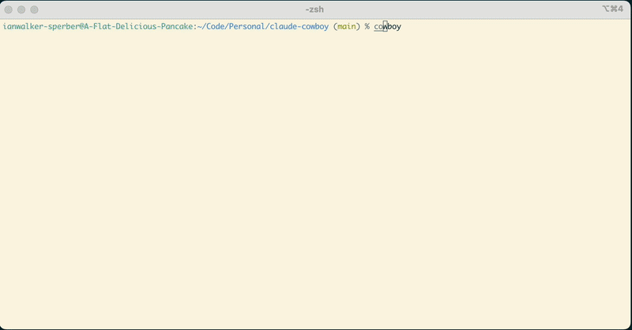

# Claude Cowboy

> **Note**: This project is experimental and not under active maintenance.
> Use at your own risk. Issues and PRs may not be addressed.

A tmux-based session manager for [Claude Code](https://github.com/anthropics/claude-code). Monitor, manage, and switch between multiple Claude Code sessions from the command line.



## Features

- **Session Browser** - fzf-based browser to view and switch between Claude sessions
- **Hook-based Status** - Real-time status detection via Claude Code hooks (working/done/wait)
- **Wait Mode** - Set timers to be notified when sessions are ready
- **Notification Sounds** - Audio alerts when Claude finishes a task
- **Tmux Integration** - Each session runs in its own tmux window for easy switching
- **Multi-Session Workflow** - Run multiple Claude Code instances across different projects
- **Session Isolation** - Git worktrees for isolated Claude state per session

## Requirements

- Python 3.12+
- [tmux](https://github.com/tmux/tmux)
- [fzf](https://github.com/junegunn/fzf) - Fuzzy finder for session browser
- [Claude Code](https://github.com/anthropics/claude-code)

## Installation

### Using uv (recommended)

```bash
# Install as a CLI tool (isolated environment)
uv tool install git+https://github.com/ianwsperber/claude-cowboy

# Or install in your current environment
uv pip install git+https://github.com/ianwsperber/claude-cowboy
```

### Using pip

```bash
pip install git+https://github.com/ianwsperber/claude-cowboy
```

### From source

```bash
git clone https://github.com/ianwsperber/claude-cowboy.git
cd claude-cowboy
uv pip install -e .  # or: pip install -e .
```

## Usage

```bash
# Create a new Claude Code session
cowboy new

# Create an isolated session (git worktree)
cowboy new -w

# Open the dashboard
cowboy dashboard

# List all sessions
cowboy list

# Attach to a session
cowboy attach <session-number>

# Kill a session
cowboy kill <session-number>
```

### Session Isolation

Use `-w` to run sessions in git worktrees, preventing Claude state from bleeding between sessions:

```bash
cowboy new ~/myproject -w                              # ~/.cowboy-worktrees/myproject-01
cowboy new ~/myproject -w --worktree-location sibling  # ~/myproject-01 (adjacent)
cowboy new ~/monorepo/service -w -m                    # Use monorepo root (skip prompt)
```

Idle worktrees are automatically reused. Home location worktrees are cleaned up when exceeding `maxWorktrees` (default: 3).

## Configuration

Settings are stored in `~/.claude/settings.json` under the `claudeCowboy` key:

```json
{
  "claudeCowboy": {
    "sessionDiscoveryHours": 24,
    "idleThresholdMinutes": 5,
    "hideThresholdMinutes": 15
  }
}
```

| Setting | Default | Description |
|---------|---------|-------------|
| `sessionDiscoveryHours` | 24 | How far back to look for sessions |
| `idleThresholdMinutes` | 5 | Time before a session is marked idle |
| `hideThresholdMinutes` | 15 | Time before inactive sessions are hidden |
| `maxWorktrees` | 3 | Max idle worktrees before cleanup (home only) |
| `worktreeLocation` | `home` | Default: `home` (~/.cowboy-worktrees) or `sibling` |

## Acknowledgments

The hook-based status detection, session browser, wait mode, and notification
features are adapted from [tmux-claude-status](https://github.com/samleeney/tmux-claude-status)
by [@samleeney](https://github.com/samleeney), used under the MIT License.

## License

MIT
